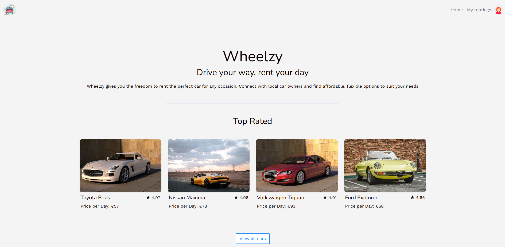
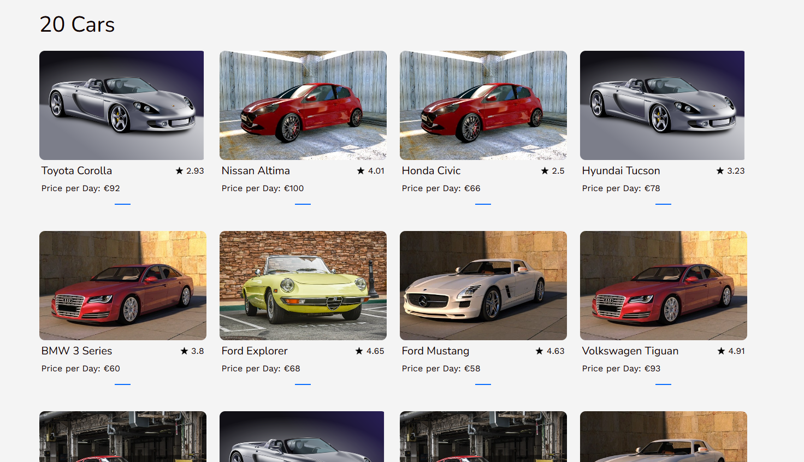
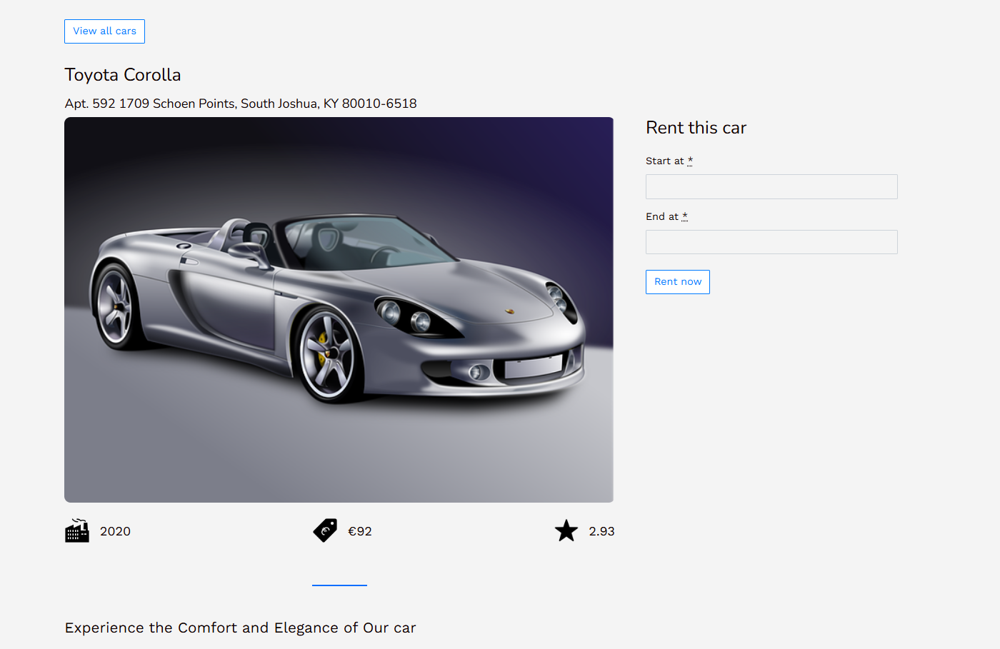
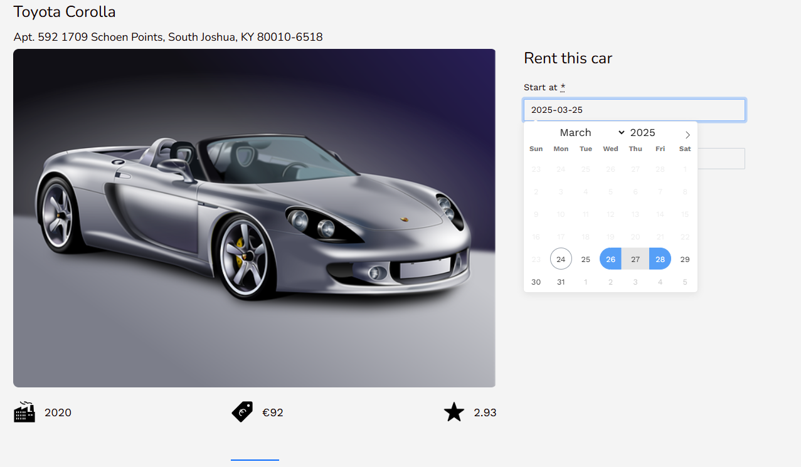
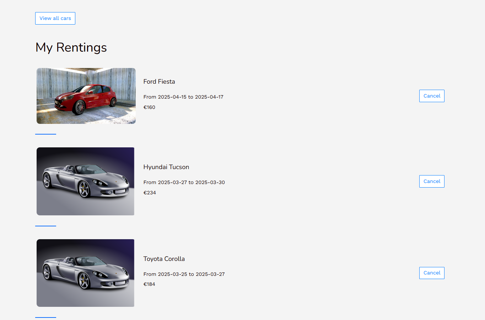

<!-- Improved compatibility of back to top link: See: https://github.com/othneildrew/Best-README-Template/pull/73 -->
<a id="readme-top"></a>

<!-- PROJECT LOGO -->
<!--<h2 align="center">SasCook</h2>-->
## Wheelzy (๑>؂•̀๑)

<!--<div align="center">
  <a href="https://github.com/github_username/repo_name">
    
  </a>


</div>-->

<h3 align="center">Drive your way, rent your day ヾ( ˃ᴗ˂ )◞ • *✰

</br>  </h3>
</br> 


## 𐙚 Table of Contents

➺ [About the Project](#about-the-project)  

➺ [Technologies & Environment](#technologies--environment)  

➺ [Key Features](#key-features)  

➺ [Getting Started](#getting-started)  

➺ [Usage](#usage)  

➺ [Future Modifications](#future-modifications)  

➺ [Screenshots](#screenshots)  

➺ [Contact](#contact)

</br> 
<!-- ## 📖 About the Project  -->
<h2 name="about-the-project">𐙚 About the project </h2>

Wheelzy is a car rental platform built using Ruby on Rails, with Bootstrap for styling and a touch of JavaScript for interactivity. The platform allows users to connect with local car owners and rent vehicles for different occasions, all while offering a seamless experience for booking, managing reservations, and viewing available cars.

This project aims to offer a simple yet powerful interface to manage car rentals efficiently, using a database-driven approach with user authentication for managing bookings.
</br> 

  
  
  
  


</br> 

<h2 name="technologies--environment">𐙚 Technologies & Environment </h2>

✦︎ Ruby on Rails 7.0.4

✦︎ JavaScript ES6

✦︎ Bootstrap 5.3

✦︎ Flatpickr (for date selection)

✦︎ Visual Studio Code

</br> 


<h2 name="key-features">𐙚 Key Features </h2>

𖤝 **Homepage**

- Catchy slogan: "Drive your way, rent your day."
- Displays the 4 top-rated cars on the platform with their names, ratings (stars), and daily prices.

𖤝 **All Cars Page**

- View all available cars with their names, ratings, and daily prices.

𖤝 **Car Details Page**

- Detailed information about each car including:
  - Car name, rating, price per day, manufacturing year, and location.
  - Select a date using Flatpickr to book the car.
  - Automatic message if the car is already booked for selected dates.

𖤝 **My Rentings Page**

- Displays all active rentals, showing the rental dates, the total price, and an option to cancel a reservation.


</br> 


<h2 name="getting-started">𐙚 Getting Started </h2>

### Requirements  
✦︎ Ruby >= 3.0

✦︎ Rails >= 7.0

✦︎ Node.js (for JavaScript & asset management)
</br> 

### Setup
(ㅅ´ ˘ `)


Clone the GitHub repository using the following command 

```bash
git clone git@github.com:SaskaPetrovic/Wheelzy.git
```

Install all the dependencies of the project

```bash
bundle install

```

Install JavaScript dependencies

```bash
npm install

```

Setup the database by running the following command

```bash
rails db:create
rails db:migrate
rails db:seed

```

Start the Rails development server

```bash
rails server

```

Access the project

```bash
http://localhost:3000

```

(づ ᴗ _ᴗ)づ♡

</br> 
<h2 name="usage">𐙚 Usage </h2>

𖹭 Browse all available cars on the "All Cars" page.

𖹭 View the details of each car, including rental price, year, and location.

𖹭 Select a date using the Flatpickr and try to rent a car.

𖹭 On the "My Rentings" page, manage your active reservations.

𖹭 Cancel any reservation if needed.

</br> 

<h2 name="future-modifications">𐙚 Future Modifications </h2>

✦︎ **Display availability**  
  - Show if the car is already booked for the selected dates.

✦︎ **Car Ratings**  
  - Allow users to rate the cars after they have rented them.

✦︎ **More Photos**  
  - Add additional images for each car to give users a better view.

✦︎ **Complete Descriptions**  
  - Provide more detailed descriptions for each car to better inform users.

✦︎ **Reservation Status**  
  - On the car details page, display a message if the user has already reserved the car for specific dates.

</br> 
<h2 name="screenshots">𐙚 Screenshots </h2>

### Homepage
<p align="left">
  
</p>

### Cars Page
<p align="left">
  
</p>

### Cars Details Page
<p align="left">
  
  
</p>

### Rentings Page
<p align="left">
  
</p>


[View Demo on youtube]() ( ꈍ◡ꈍ)


</br> 
<h2 name="contact">☕︎ Connect with me</h2>

˗ˏˋ ✉︎ ˎˊ˗  **saskapetrovic.pro@gmail.com**

˗ˏˋ ✎ ˎˊ˗  [LinkedIn](https://www.linkedin.com/in/saska-petrovic-2137072a2)
